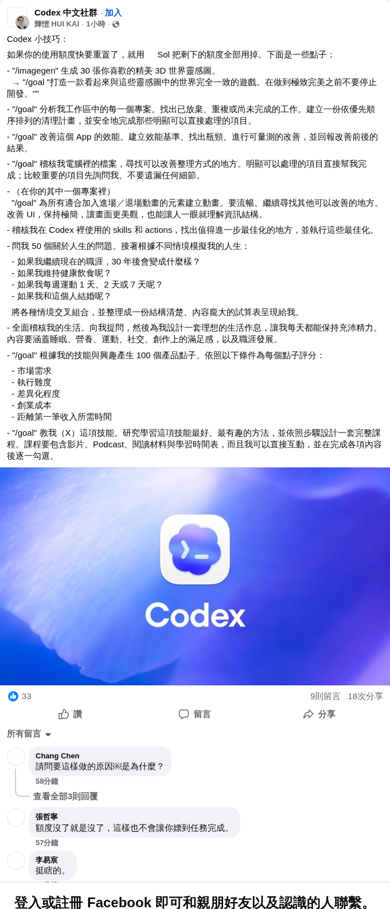
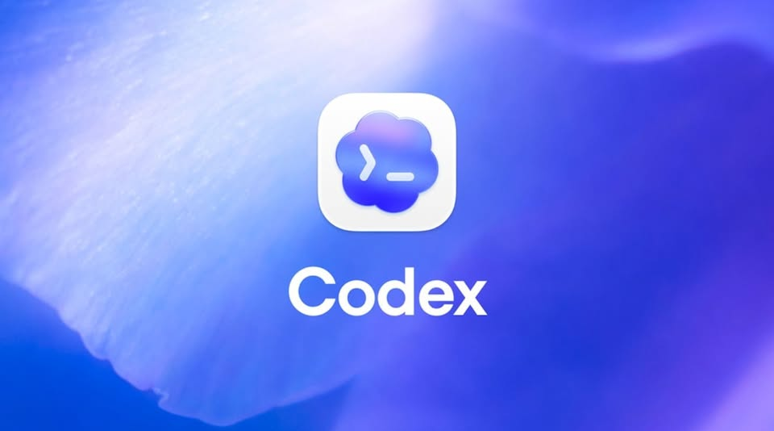

# Facebook｜Codex 額度重置前的 Sol 與 /goal 任務靈感清單

## 一句話摘要

這是一份「額度重置前可以拿 Codex 做什麼」的靈感清單；真正值得保存的不是把額度用光，而是把大型目標改寫成可分段、可檢查、可驗證的工作流程。

## 為什麼保存

它把 coding agent 的使用範圍從單一程式修改，擴展到專案稽核、產品研究、課程設計與生活規劃。這些例子適合作為 prompt／任務設計的靈感，但不能直接視為 Codex 官方保證的功能或產出能力。

## 來源證據

- 擷取網址：<https://www.facebook.com/groups/1713764039757273/permalink/1794884368311906/>
- 擷取時間：2026-08-07T17:49:21+00:00
- 可見群組：Codex 中文社群
- 可見作者：輝堂 HUI KAI
- 公開頁面回應：HTTP 200；頁面截圖可見貼文與附圖。Facebook 會顯示登入註冊提示，但本次保存的貼文區域已關閉遮罩。
- 截圖中可見互動數：33 個讚、9 則留言、18 次分享；這些數字可能隨時間變動，不作為永久統計。

## 可見資訊

- 貼文先以「如果你的使用額度要重置了，就用 Sol 把剩下的額度全部用掉」作為情境開場。
- 貼文列出 `/imagegen` 產生 3D 世界、`/goal` 遊戲開發、專案分析、App 改善、檔案整理、生活情境模擬、skills/actions 最佳化、產品點子與課程設計等方向。
- 貼文附有 Codex 藍紫色品牌圖片；原始附圖另存於 `2026-08-07-facebook-codex-sol-goal-original.jpg`。
- 留言區包含對「額度沒了就停止」與任務未完成風險的個人回覆；這是社群經驗，不是官方保證。

## 重點整理

### 1. 專案與程式碼工作

- 要求 agent 分析工作區中每個專案，找出放棄、重複或未完成的工作。
- 以優先順序重新排程，並要求實際完成，而不是只列出問題。
- 讓 `/goal` 依照技能與興趣產生產品點子，再以市場需求、執行難度、差異化、創業成本與達到第一筆收入的時間評分。

### 2. 研究、內容與自我規劃

- 貼文建議用 agent 進行 App 功能改善、檔案整理、技能最佳化與課程設計。
- 也提出職涯、健康、運動、婚姻等情境推演；這類輸出應視為反思問題與假設情境，不是預測、醫療建議或人生決策依據。

## 技術或背景脈絡

「Sol」與 `/goal` 不能只依貼文文字判斷。官方文件目前可確認 Codex 文件列出 `gpt-5.6-sol` 模型，以及 slash commands 頁面列出 `/goal`、`/usage` 等指令。`/usage` 可查看 token 使用或 rate-limit reset；這支持「額度重置前要掌握剩餘時間／用量」的工作背景，但不代表官方建議把額度全部消耗掉。

另一方面，官方 slash commands 清單中沒有找到 `/imagegen`。官方網站有 Image generation 導覽內容，但這不足以證明 `/imagegen` 是所有 Codex 環境都可用的內建指令；它可能是特定版本、第三方整合或自訂 skill/action。

## 資訊查核

| 原始主張 | 查核結論 | 狀態 | 可靠來源 |
|---|---|---|---|
| Codex 有 `gpt-5.6-sol`／Sol 模型可用 | 官方 models 頁面的原始 HTML 可找到 `gpt-5.6-sol` | 已驗證（存在性） | [Codex models](https://learn.chatgpt.com/docs/models) |
| `/goal` 是 Codex 可用的 slash command | 官方 developer commands 頁面列出 `/goal` | 已驗證（指令列出） | [Codex slash commands](https://learn.chatgpt.com/docs/developer-commands?surface=cli) |
| `/usage` 可查看用量／rate-limit reset | 官方 developer commands 頁面列出 `/usage`，用途是查看 account token usage 或 rate-limit reset | 已驗證（功能描述） | [Codex slash commands](https://learn.chatgpt.com/docs/developer-commands?surface=cli) |
| `/imagegen` 是標準內建 slash command | 在官方 slash commands 頁面未找到 `/imagegen`；不能由官方 Image generation 導覽反推指令存在 | 未能驗證／環境相關 | [Codex slash commands](https://learn.chatgpt.com/docs/developer-commands?surface=cli) |
| 額度用完時大型任務一定會停止且無法完成 | 留言是個人經驗；官方文件可支持「用量與 reset 可查」，不能支持每種任務都會如何停止 | 未能驗證 | [Codex prompting](https://learn.chatgpt.com/docs/prompting) |
| 用 `/goal` 做人生、健康或婚姻模擬能得到可靠答案 | 這屬於建議與情境推演，不是可由官方文件驗證的事實，也不應取代專業判斷 | 屬於觀點／建議 | [Codex prompting](https://learn.chatgpt.com/docs/prompting) |

## 觀察與可應用情境

- 先要求 agent 讀取現況、列出目標、定義完成條件，再開始修改；這比「把剩餘額度全部用掉」更可重複。
- 大型任務應拆成「盤點 → 優先排序 → 執行一個切片 → 測試／驗證 → 回報 → 下一階段」；每階段都要留下檔案、diff、測試結果或連結。
- 生活類 prompt 可改寫成問題清單、假設比較與行動實驗，不要要求 agent 直接預言未來。
- 額度即將重置時，優先選擇能在單次工作窗內留下可移交成果的任務，例如稽核報告、測試補強、文件更新與可重現的研究摘要。

## 風險與限制

- 「把額度全部用掉」是社群用語，不是官方最佳實務；浪費額度、產出不可驗證或任務中斷都是可能結果。
- Facebook 公開頁面與互動數可能變動；本筆記保存截圖與原始文字快照，避免日後頁面變更造成證據遺失。
- `/imagegen` 是否可用取決於實際 Codex 版本、工作區、已安裝的 skills/actions 與權限，不應直接複製到另一個環境。
- agent 產生的市場、健康、職涯與關係建議可能錯誤或帶有偏見，應以可查證資料與人類決策為準。

## 行動洞察

- 把 `/goal` 當作「目標管理介面」，而不是一句會自動完成一切的魔法指令。
- 每個 goal 都加入範圍、輸入、禁止事項、驗收標準、檢查點與失敗時的交接格式。
- 針對未確認的 command，先用 `/usage`、help 或官方文件確認，再投入長任務。

## 參考資料

- [原始 Facebook 公開貼文](https://www.facebook.com/groups/1713764039757273/permalink/1794884368311906/)
- [Codex slash commands（官方）](https://learn.chatgpt.com/docs/developer-commands?surface=cli)
- [Codex models（官方）](https://learn.chatgpt.com/docs/models)
- [Codex prompting（官方）](https://learn.chatgpt.com/docs/prompting)

## 延伸關鍵字

- Codex
- gpt-5.6-sol
- /goal
- /usage
- coding agent
- 任務拆解
- 配額管理
- prompt engineering
