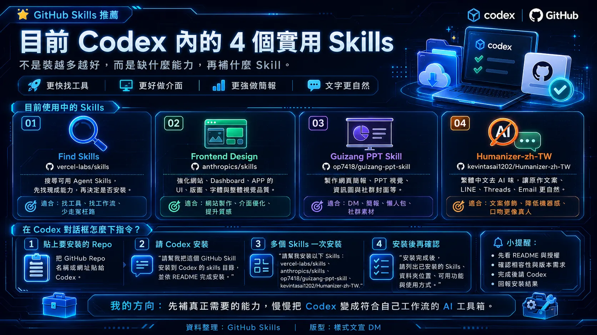

## 可見資訊

這則 Threads 貼文由帳號 `soolboyss` 發布，頁面顯示約 18 hours ago。作者表示自己使用 Codex 製作房仲工具、網站與自動化，並採取「工作上缺什麼，再補什麼」的 Skills 管理方式，而不是一次安裝大量 Skills。

頁面同時顯示約 1.8K views、25 likes、1 repost 與 34 shares。這些數字是擷取當時的頁面顯示值，不代表固定或可重現的統計結果。

## 四個 Skills

1. **Find Skills** — `vercel-labs/skills`
   - 用途：搜尋 GitHub 上可用的 Agent Skills。
   - README 查核：repository 存在，且 README 列出支援 Codex、Claude Code、OpenCode、Cursor 等多種 agent。

2. **Frontend Design** — `anthropics/skills`
   - 用途：改善網站、Dashboard、APP 的 UI、版面與視覺品質。
   - README 查核：repository 存在；README 說明這是 Anthropic 的 Claude Skills 實作，包含可重複使用的指令、腳本與資源。貼文描述的 Codex 相容性未由該 README 單獨證明。

3. **Guizang PPT Skill** — `op7418/guizang-ppt-skill`
   - 用途：製作網頁簡報、PPT 視覺、DM、資訊圖與社群素材。
   - README 查核：repository 存在；README 明確列出 Claude Code 與 Codex 支援，並將用途描述為網頁 PPT、配圖與封面。

4. **Humanizer-zh-TW** — `kevintsai1202/Humanizer-zh-TW`
   - 用途：降低繁體中文文字的 AI 風格，應用於房仲文案、LINE、Threads 與 Email。
   - README 查核：repository 存在；README 將其描述為繁體中文版 AI 寫作人性化工具，並說明其參考與翻譯來源。

## 可重現的整理方式

若要採用相同思路，可以先把工作需求拆成能力缺口，再逐一檢查 Skill 的 repository、README、授權、相依套件與安裝方式。不要只因名稱看起來合適就直接安裝。

貼文圖片提出的操作概念是：

1. 把要安裝的 GitHub repository 名稱或網址提供給 Codex。
2. 要求 Codex 將 Skill 安裝到對應的 skills 目錄，並依 README 完成安裝。
3. 多個 Skills 可以一次列出，但仍應逐一確認來源與相容性。
4. 安裝後列出已安裝項目、資料夾位置、可用功能與使用方式。

以上是貼文圖片呈現的操作建議，不是對所有 Codex 版本或所有 Skills 都保證有效的通用命令。實際安裝前應以各 repository 的 README 與目前 Codex 文件為準。

## 資訊查核

| 主張 | 結果 | 證據與限制 |
|---|---|---|
| `vercel-labs/skills` 存在 | 已證實 | GitHub API 回傳 HTTP 200；README 列出 Codex 支援。 |
| `anthropics/skills` 存在 | 已證實 | GitHub API 回傳 HTTP 200；README 說明 Anthropic Claude Skills 實作。 |
| `op7418/guizang-ppt-skill` 存在 | 已證實 | GitHub API 回傳 HTTP 200；README 列出 Claude Code 與 Codex 支援。 |
| `kevintsai1202/Humanizer-zh-TW` 存在 | 已證實 | GitHub API 回傳 HTTP 200；README 描述繁體中文 AI 寫作人性化工具。 |
| 這 4 個是作者目前最常用的 Skills | 作者自述 | 個人使用情況，無法由 GitHub repository 獨立證明。 |
| 安裝後寫網站、設計 APP 感覺比以前好 | 無法客觀確認 | 缺乏基準版本、測試任務、評分方法與可重現實驗。 |
| 貼圖中的安裝指令適用所有 Codex 版本 | 無法確認 | Codex 版本、skills 目錄與各 repository 安裝需求可能不同。 |

## 來源證據

- 來源 URL：`https://www.threads.com/@soolboyss/post/DbwjhFFgeV0`
- 擷取時間：2026-08-08
- 證據用途：核對貼文中列出的四個 Skills、GitHub repository 名稱與安裝建議。
- 隱私處理：公開圖未納入作者實名、頭像或留言者資料；原始 HTML 另存於 `source-archive/private/`，不部署。

## 限制

- Threads 頁面正文雖可由目前瀏覽器 session 讀取，但同時顯示登入提示，因此不宣稱所有匿名訪客均可讀取。
- 原始頁面只顯示相對時間，未取得可獨立確認的絕對發布日期。
- 本文沒有執行四個 Skills 的完整安裝與效能比較。
- Repository 存在與 README 描述，不等同於安全性、維護品質或實際輸出成效的保證。
- 安裝第三方 Skills 前，應檢查 README、授權、腳本、hooks、MCP、相依套件與可能的檔案寫入行為。

## 參考資料

- [Threads 原始貼文](https://www.threads.com/@soolboyss/post/DbwjhFFgeV0)
- [vercel-labs/skills](https://github.com/vercel-labs/skills)
- [anthropics/skills](https://github.com/anthropics/skills)
- [op7418/guizang-ppt-skill](https://github.com/op7418/guizang-ppt-skill)
- [kevintsai1202/Humanizer-zh-TW](https://github.com/kevintsai1202/Humanizer-zh-TW)
