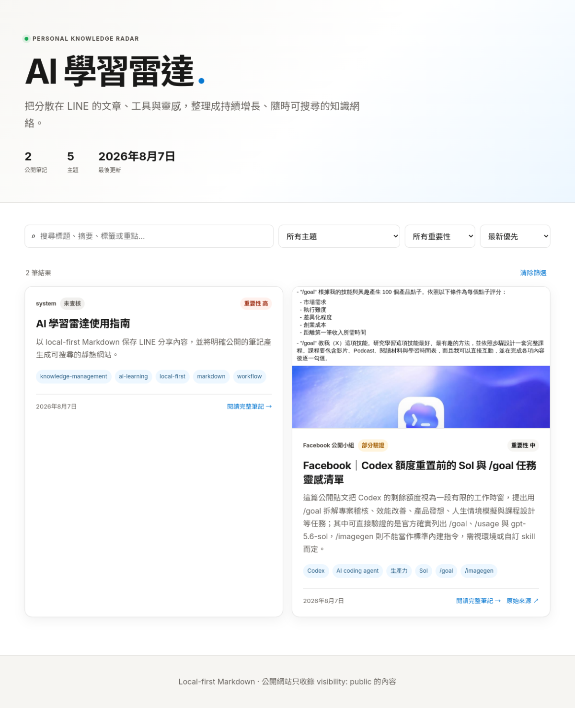

# AI 學習雷達使用指南

## 一句話摘要

以 local-first Markdown 保存 LINE 分享內容，保留原始證據與整理版，再將明確標示為 public 的筆記產生成可搜尋的靜態網站。

## 為什麼保存

這篇指南是知識庫的操作契約：它說明資料放在哪裡、什麼可以公開、哪些內容必須留在本機，以及如何用可重現的建站與驗證流程降低遺漏與誤公開風險。

## 來源證據

- 公開網站：<https://m11515115e.github.io/ai-learning-radar/>
- GitHub 儲存庫：<https://github.com/M11515115e/ai-learning-radar>
- 截圖擷取時間：2026-08-07T18:10:19+00:00
- 公開首頁與 `data/notes.json` 回應 HTTP 200；首頁截圖可見公開筆記搜尋介面、主題篩選、重要性篩選與排序控制。
- 本筆記的規則與實作位於 `/opt/data/user-notes/knowledge-base/`，網站是由 Markdown 重新產生的輸出，不是唯一資料來源。

## 可見資訊

- 公開網站目前顯示「公開筆記」、主題統計、最後更新日期與可搜尋的筆記卡片。
- 每張公開卡片可以顯示來源、查核狀態、重要性、標籤、證據圖片與獨立文章頁。
- 獨立文章頁包含來源證據、查核表、參考資料與側欄 metadata。
- 私人資料與 `source-archive/` 不應出現在公開索引或部署輸出中。

## 重點整理

### 1. Local-first 資料層

- Markdown 是主資料來源，檔案位於 `/opt/data/user-notes/knowledge-base/`。
- 整理版放在 `articles/`、`topics/` 等目錄；原始資料快照放在 `source-archive/public/` 或 `source-archive/private/`。
- 原始資料不可被整理版覆寫，方便日後重新查核。

### 2. Public／private 邊界

- 明確公開、沒有個資或內部內容的素材，才可使用 `visibility: public`。
- 文章預設公開，但私人資料、登入後內容、私訊、未公開課程、登入頁與敏感原始證據不得部署；應先去識別化後只公開可查核摘要。
- `private/` 與 `source-archive/` 不部署；公開圖片只能從 `assets/public/` 複製到網站。

### 3. 證據型文章

公開來源不再只保留摘要。只要有原始 URL，筆記應包含：來源截圖或原始附圖、來源證據、可見資訊、資訊查核、限制、參考資料與可點擊連結。查不到的資訊必須明確標示「未能驗證」，不能用推測補齊。

## 技術或背景脈絡

建站流程是可重建的：`scripts/build-site.py` 讀取 public Markdown、複製 `assets/public/`、產生 `site/data/notes.json`、`data.js` 與獨立文章頁；`scripts/validate-kb.py` 再檢查欄位、檔名、文章頁、證據欄位與 private/source-archive 是否外洩；通過後才由 `scripts/deploy-site.py` 推送 GitHub Pages。

這種設計把「內容真實性」「公開權限」與「網站呈現」拆成不同檢查點，任何一層失敗都應停止部署，而不是只看 git push 是否成功。

## 資訊查核

| 原始主張 | 查核結論 | 狀態 | 可靠來源 |
|---|---|---|---|
| Markdown 是知識庫主資料來源 | 建站腳本直接讀取 public Markdown 並產生網站資料 | 已驗證 | [GitHub 公開儲存庫](https://github.com/M11515115e/ai-learning-radar) |
| 公開網站只收錄 visibility: public | `build-site.py` 只收錄 public；`validate-kb.py` 與 deploy privacy check 會檢查私有資料是否外洩 | 已驗證 | [GitHub 公開儲存庫](https://github.com/M11515115e/ai-learning-radar) |
| public 筆記有獨立文章頁與查核欄位 | 公開首頁、JSON 與本篇文章頁均 HTTP 200；HTML 可見來源、查核與參考資料區段 | 已驗證 | [AI 學習雷達公開網站](https://m11515115e.github.io/ai-learning-radar/) |
| 所有原始來源都能被完整擷取 | 不成立；登入牆、動態頁面、刪文或權限變更仍可能限制取得內容 | 未能驗證／有限制 | [AI 學習雷達公開網站](https://m11515115e.github.io/ai-learning-radar/) |
| 參考知識庫格式適合用來設計證據型文章 | 這是格式借鑑與整理方法，不是外部事實主張 | 屬於整理方法 | [證據型文章格式參考](https://m11808008.github.io/hermes/knowledge-base/articles/2026-08-07-facebook-reel-one-person-company-hermes-qwen-sft-finetuning.html) |

## 觀察與可應用情境

- 分享 LINE 連結時附上「公開／私人」、用途與重要性，能減少後續判斷成本。
- 文章、影片與社群貼文先保存原始連結與快照，再整理成可搜尋筆記。
- 每週回顧時，把相同主題的文章補上相關連結，逐漸形成知識網絡。
- 需要跨裝置搜尋時使用公開網站；需要完整原始資料、私人內容或未公開資料時使用本機 Markdown。

## 風險與限制

- 公開性不明時應採 private；網站可公開不代表來源內容永久公開。
- Facebook、影片平台與動態網站可能改變內容、互動數、登入狀態或存取權限，因此截圖與快照只能代表擷取當下。
- 自動摘要不能代替原文查核；查核表要清楚分開原始主張、官方資料與整理者推論。
- GitHub Pages 是公開輸出，部署前必須檢查路徑、圖片與 JSON 是否包含私人內容。

## 行動洞察

- 分享連結時附上「公開／私人」、「重要性」或預期用途。
- 每次歸檔後執行 `python3 scripts/build-site.py` 與 `python3 scripts/validate-kb.py`。
- 公開來源優先保存證據圖片，再撰寫摘要與查核表。
- 每週回顧新內容，補上相關主題、官方來源與下一步行動。

## 參考資料

- [AI 學習雷達公開網站](https://m11515115e.github.io/ai-learning-radar/)
- [GitHub 公開儲存庫](https://github.com/M11515115e/ai-learning-radar)
- [證據型文章格式參考](https://m11808008.github.io/hermes/knowledge-base/articles/2026-08-07-facebook-reel-one-person-company-hermes-qwen-sft-finetuning.html)

## 延伸關鍵字

- local-first
- Markdown
- knowledge-management
- privacy-by-default
- public/private isolation
- evidence-based notes
- GitHub Pages
- LINE
